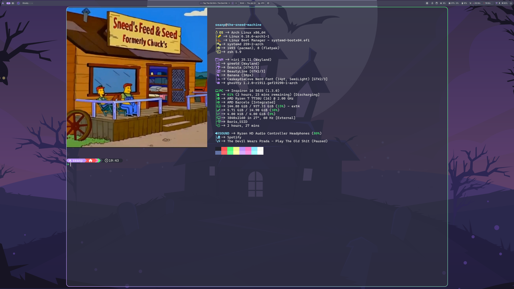
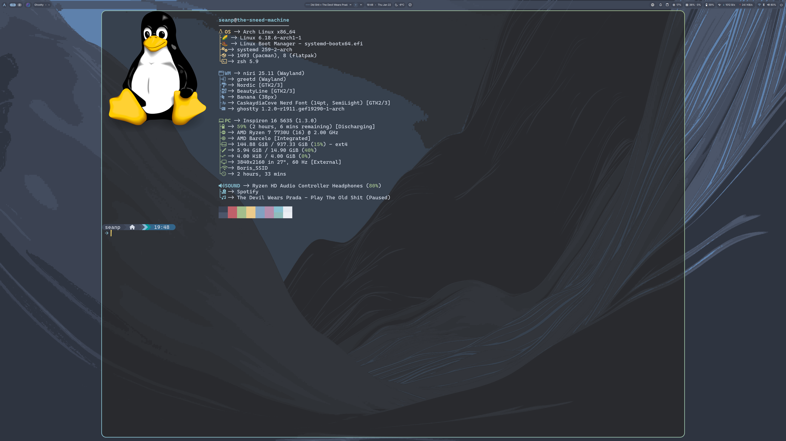

# SneederLand

My dotfiles

## Overview

This is my dotfiles repo which includes a script that installs all needed
packages and links my configuration with GNU Stow. Feel free to copy the stuff
in this repo since I copied a lot of it mostly from [Eric Murphy](https://github.com/ericmurphyxyz).
You should also look at the docs for the packages if you wanna change anything.

### Themes

#### Rose Pine


#### Catppuccin


#### Dracula



#### Gruvbox


#### Tokyo Night


#### Nord



#### Everforest


### Programs I use

- Window manager: [Niri](https://yalter.github.io/niri/index.html)
- Status bar: [Dank Material Shell](https://danklinux.com)
- Terminal: [Ghostty](https://github.com/ghostty-org/ghostty)
- Shell: [Zsh](https://wiki.archlinux.org/title/Zsh)
- Browser: [Helium](https://helium.computer/)
- Text editor: [Neovim](https://github.com/neovim/neovim)
- File manager: [Yazi](https://github.com/sxyazi/yazi)

and a ton of other stuff

## Installation

> [!IMPORTANT]
> This script will only work on Arch Linux (and Arch-based distros but who uses  
> those anyway?) so put on your knee high socks and cat ears and start commenting  
> "I use arch btw :3" on every social media post you encounter

Clone this repo and run `installer.sh`

```bash
git clone --depth=1 https://github.com/seanPruss/sneederland.git
cd sneederland
./installer.sh
```

> [!NOTE]
> My name and noreply github email is in `.gitconfig` so obviously change that  
> to yours
